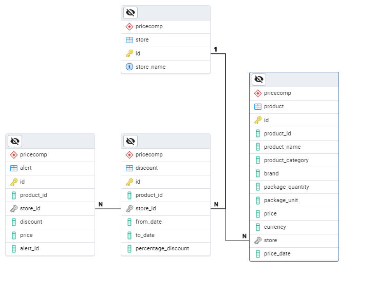

# Price Comparator

This is a backend application for comparing prices of products across different stores.
It is build with Java and Spring Boot and uses a PostgreSQL database.

---

# Overview

## Project structure

The application is structured into several packages:

- `com.pricecomparator`: The main package containing the application entry point.
- `com.pricecomparator.controller`: Contains the REST controllers for handling HTTP requests.
- `com.pricecomparator.model`: Contains the data models used in the application.
- `com.pricecomparator.repository`: Contains the repositories for accessing the database.
- `com.pricecomparator.service`: Contains the service classes for business logic.

## Technologies Used

- Java 21
- Spring Boot 3.4.5
- PostgreSQL
- Maven

## Database Schema

The database schema is defined in the `src/main/resources/schema.sql` file.
Image of the schema: 

---

# How to run the application

### 1. Clone the repository:

   ```bash
   git clone https://github.com/TicaSergiu/price-comparator
   cd price-comparator
   ```

### 2. Set up the database:

- Create a PostgreSQL database named `market`.
- Run the SQL script located in `src/main/resources/schema.sql` to create the necessary tables.
- Update the database connection properties in `src/main/resources/application.properties` file:
  ```properties
  spring.datasource.url=jdbc:postgresql://localhost:5432/price_comparator
  spring.datasource.username=your_username
  spring.datasource.password=your_password
  ```

### 3. Run the application:

- Make sure you have Java 21 and Maven installed.
- Navigate to the project directory and run:
  ```bash
  mvn spring-boot:run
  ```

  ---

# API Endpoints ('/api/')

### [BasketController](src/main/java/com/pricecomparatormarket/controllers/BasketController.java)

`GET /api/optimize-basket` - Receives a list of products and returns the optimal basket with the best prices from
different stores.

#### Request Example

```json
{
  "products": [
    {
      "productId": "P001",
      "quantity": 2
    },
    {
      "name": "P027",
      "quantity": 1
    }
  ]
}
```

### [DiscountController](src/main/java/com/pricecomparatormarket/controllers/DiscountController.java)

`GET /api/discount/best-discounts` - Returns the best discounts available right now.

`GET /api/discount/latest` - Returns the discounts added in the last 24 hours.

### [PriceHistoryController](src/main/java/com/pricecomparatormarket/controllers/PriceHistoryController.java)

`GET /api/price-history/{id}?` - Returns the price history of a product from a start date to an end date by product ID.
Can be filtered by store,category, or brand.

#### Request example to get a product's price history from 2025-05-01 to 2025-05-23 by a specific brand:

```http request
GET /api/price-history/P001?from=2025-05-01&to=2025-05-23&brand=Zuzu
```

`GET /api/price-history/store/{store}` - Returns the price history of all products from a specific store. Can be
filtered by category and brand.

### [AlertController](src/main/java/com/pricecomparatormarket/controllers/AlertController.java)

`POST /api/alert` - Creates a new price alert for a product for a user. The request needs a price or discount threshold.

`GET /api/alert/check` - Checks if there are any price alerts that have been triggered for a user.

---

# Assumptions or simplifications made

1. For alerts, there are no user accounts, so they just have an alert_id instead of a user_id.
2. Some services and repositories handle dates by using `NOW()` in the SQL queries.
3. There is no Product Substitution & Recommendation feature implemented.
4. There is no consistent 'returning' architecture, so the application is not consistent in returning the same type of
   response for all endpoints.
5. There are not tests.
6. The application does not handle errors.